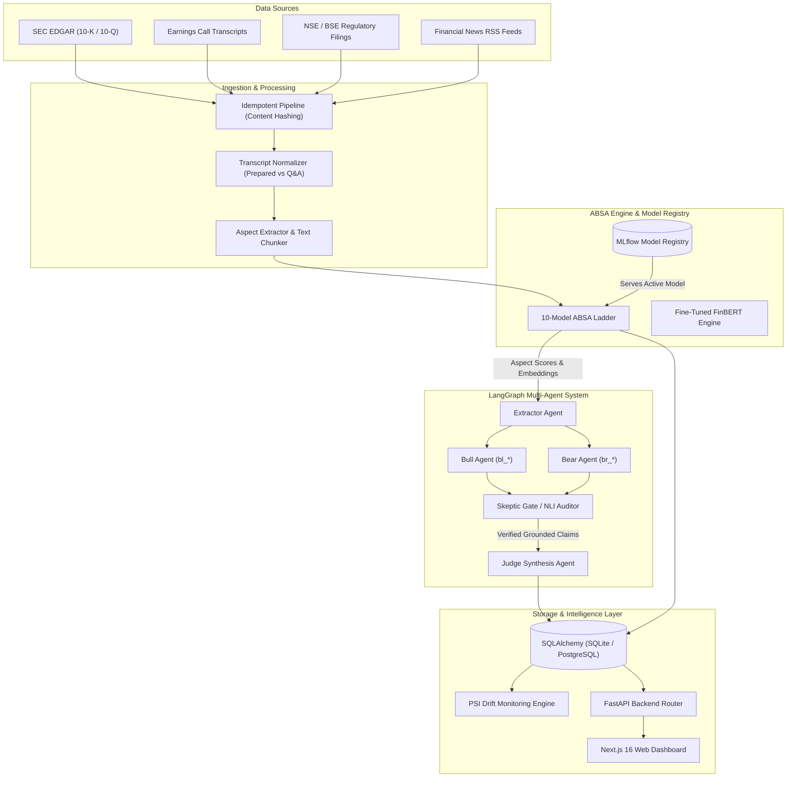
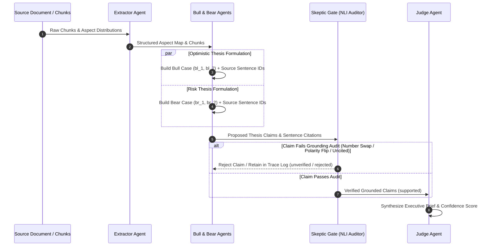

<div align="center">

# Sentari

### Financial Aspect-Based Sentiment Analysis & Grounded Multi-Agent Intelligence Engine

*Track quarter-over-quarter guidance, margin dynamics, demand trends, management tone, and litigation risks with sentence-level grounding.*

[](https://python.org)
[](https://fastapi.tiangolo.com/)
[](https://nextjs.org)
[](https://huggingface.co/ProsusAI/finbert)
[](https://github.com/langchain-ai/langgraph)
[](https://mlflow.org)
[](https://docker.com)

---

</div>

> [!IMPORTANT]  
> **Research & Decision-Support Tool — Not Financial or Investment Advice.**  
> Sentari processes financial disclosures, SEC filings, and earnings transcripts for academic research and qualitative decision support. It does not predict stock price movements, guarantee financial returns, or execute automated trades.

---

## Table of Contents

- [Executive Summary](#executive-summary)
- [Key Features](#key-features)
- [System Architecture](#system-architecture)
- [Multi-Agent Debate Pipeline](#multi-agent-debate-pipeline)
- [The 6 Financial Aspects](#the-6-financial-aspects)
- [Empirical Benchmarks & Results](#empirical-benchmarks--results)
  - [10-Model ABSA Ladder Performance](#1-10-model-absa-ladder-performance)
  - [Skeptic Adversarial Grounding Audit](#2-skeptic-adversarial-grounding-audit)
  - [Lexicon Failure & Financial Trap Analysis](#3-lexicon-failure--financial-trap-analysis)
- [Repository Architecture](#repository-architecture)
- [Getting Started](#getting-started)
  - [Prerequisites](#prerequisites)
  - [Installation & Virtual Environment](#installation--virtual-environment)
  - [Running the Daily Pipeline & CLI](#running-the-daily-pipeline--cli)
  - [Launching Backend API & Dashboard](#launching-backend-api--dashboard)
  - [Docker & Containerized Deployment](#docker--containerized-deployment)
- [Environment Configuration](#environment-configuration)
- [REST API Reference](#rest-api-reference)
- [Project Scope & Limitations](#project-scope--limitations)
- [Academic Credit & License](#academic-credit--license)

---

## Executive Summary

Retail investors managing a portfolio of 15–20 equities face an asymmetric information challenge: quarterly earnings calls, SEC EDGAR 10-K/10-Q filings, and press releases contain thousands of sentences dense with financial nuances, guidance revisions, and hedging language.

Standard financial sentiment analysis tools typically reduce an entire earnings transcript or SEC filing into a single document-level scalar polarity score (e.g., `+0.35`). This approach obscures critical micro-signals—such as strong revenue expansion offset by severe margin compression or emerging litigation exposure.

**Sentari** solves this by delivering an end-to-end, aspect-level financial intelligence framework. It isolates **6 financial aspects** (*Guidance, Margins, Demand, Litigation, Management Tone, Liquidity*), evaluates them using a **10-model benchmarked ABSA ladder** (ranging from dictionary baselines to fine-tuned **FinBERT** achieving **0.938 Macro-F1**), and orchestrates a **LangGraph multi-agent debate** (`Extractor` $\rightarrow$ `Bull` $\parallel$ `Bear` $\rightarrow$ `Skeptic` $\rightarrow$ `Judge`). 

To eliminate Large Language Model (LLM) hallucinations, Sentari enforces a strict **Skeptic Grounding Audit Gate** backed by Natural Language Inference (NLI), achieving a **100% catch rate** across number swaps, fabricated claims, and polarity flips.

---

## Key Features

- **Aspect-Based Sentiment Extraction (ABSA)**: Combines spaCy dependency parsing, negation detection, and directional modifier rules to map raw financial text to 6 target financial domains.
- **10-Model ABSA Benchmark Ladder**: Benchmarked across Lexicons (VADER, SentiWordNet, Loughran-McDonald), Classical ML (Naive Bayes, Decision Trees), Deep Learning (CNN, BiLSTM), and Fine-Tuned Transformers (**FinBERT**).
- **LangGraph Multi-Agent Grounded Debate**: Features specialized autonomous agents:
  - **Extractor**: Isolates financial chunks and aspect score distributions.
  - **Bull & Bear**: Formulate optimistic (`bl_*`) and risk-focused (`br_*`) investment theses with exact sentence citations.
  - **Skeptic Gate**: Audits every thesis claim against source text using heuristic rules or transformer NLI models before inclusion.
  - **Judge Agent**: Synthesizes verified claims into executive investment briefs.
- **Q&A vs. Prepared Remarks Divergence**: Detects tone shifts between management's scripted remarks and unscripted executive answers during analyst Q&A sessions.
- **Population Stability Index (PSI) Drift Monitoring**: Automatically monitors aspect distribution drift and model prediction stability across quarterly reporting cycles.
- **Enterprise Web Dashboard**: Built on Next.js 16 with interactive sentiment trajectories, aspect heatmaps, drift visualizers, and expandable source text drawers.
- **Notification Engines**: Automated daily digest delivery via Slack webhooks and SMTP email notifications.

---

## System Architecture

The following diagram illustrates Sentari's data flow from multi-source ingestion to ABSA scoring, agent orchestration, storage, and presentation:



---

## Multi-Agent Debate Pipeline

Sentari models financial interpretation as an adversarial debate. Claims formulated by the Bull and Bear agents must survive rigorous sentence-level verification by the Skeptic Gate before reaching the Judge Agent.



### Agent Roles & Claim Lifecycle

1. **Extractor Agent**: Ingests document chunks, extracts aspect scores, and structures sentence-level metadata.
2. **Bull Agent (`bl_*`)**: Constructs the optimistic thesis, highlighting margin expansion, demand tailwinds, and raised guidance.
3. **Bear Agent (`br_*`)**: Constructs the risk thesis, flagging cost inflation, litigation risks, liquidity pressures, and demand deceleration.
4. **Skeptic Gate**: Verifies claim grounding against exact source sentence IDs. Claims are categorized into:
   - `supported`: Verified against verbatim source text; included in executive brief.
   - `unverified`: Partially supported or missing strict evidence; presented separately.
   - `rejected`: Hallucinated, polarity-inverted, or numerically altered; dropped from the brief and logged in `agent_traces`.
5. **Judge Agent**: Synthesizes verified claims into a cohesive executive brief with balanced insights.

---

## The 6 Financial Aspects

Sentari targets six critical financial operational domains:

| Aspect Keyword | Operational Definition | Sample Positive Sentence | Sample Negative Sentence |
| :--- | :--- | :--- | :--- |
| **`guidance`** | Forward-looking revenue, EPS, or growth projections | *"We are raising full-year revenue outlook to $4.2B."* | *"Uncertainty forces us to lower full-year EPS guidance."* |
| **`margins`** | Gross, operating, EBITDA, or net margin dynamics | *"Gross margin expanded 180 basis points year-over-year."* | *"Operating margins contracted due to rising freight costs."* |
| **`demand`** | Order volume, organic backlog, and customer adoption | *"Backlog grew 24% driven by strong enterprise demand."* | *"We observed demand deceleration across retail segments."* |
| **`litigation`** | Regulatory inquiries, lawsuits, and compliance risks | *"Settlement resulted in full dismissal of outstanding claims."* | *"Class-action lawsuit poses material financial risk."* |
| **`management_tone`** | Executive confidence, hedging, and transparency | *"Management remains confident in long-term execution."* | *"Management offered guarded commentary regarding Q4."* |
| **`liquidity`** | Cash reserves, debt covenants, free cash flow, capital | *"Free cash flow generation reached a record $850 million."* | *"Liquidity pressures necessitated credit facility drawdown."* |

---

## Empirical Benchmarks & Results

Full benchmarks and evaluation scripts are available in [`evaluation/`](file:///C:/Users/Asus/OneDrive/Desktop/Sentari/evaluation) and detailed in [`results/REPORT.md`](file:///C:/Users/Asus/OneDrive/Desktop/Sentari/results/REPORT.md).

### 1. 10-Model ABSA Ladder Performance

Evaluated on **94 gold-standard sentences** (6 aspects $\times$ 3 sentiment classes) and **26 financial trap sentences**:

| Model Architecture | Model Category | Macro-F1 | Accuracy | Trap Acc. | Key Description & Modalities |
| :--- | :--- | :---: | :---: | :---: | :--- |
| **VADER** | General Lexicon | `0.647` | `0.649` | `0.380` | Rule-based lexicon (fails on domain terminology) |
| **SentiWordNet** | General Lexicon | `0.490` | `0.489` | `0.270` | Synset-level polarity scoring |
| **Loughran-McDonald (LM)** | Financial Lexicon | `0.756` | `0.755` | `0.420` | Financial dictionary baseline |
| **LM + Directional Rules** | Hybrid Lexicon | `0.892` | `0.894` | `0.850` | Financial lexicon + directional modifier logic |
| **Naive Bayes (TF-IDF)** | Classical ML | `0.743` | `0.745` | `0.690` | Multi-class Naive Bayes classifier |
| **Decision Tree (TF-IDF)** | Classical ML | `0.519` | `0.532` | `0.580` | Decision tree classifier baseline |
| **1D CNN** | Deep Learning | `0.739` | `0.745` | `0.920` | 1D Convolutional Neural Network on word vectors |
| **BiLSTM** | Deep Learning | `0.607` | `0.638` | `0.810` | Bidirectional Recurrent Neural Network |
| **FinBERT (Zero-Shot)** | Pre-trained Transformer | `0.601` | `0.606` | `0.350` | Pre-trained domain transformer (zero-shot) |
| **FinBERT (Fine-Tuned)** | **Fine-Tuned Transformer** | **`0.938`** | **`0.936`** | **`0.880`** | **Domain-adapted sequence classification model** |

> [!NOTE]  
> **Evaluation Insights**: General lexicons struggle with domain-inverted polarities (e.g., *"litigation expenses decreased"* is positive, but *"expenses"* is flagged as negative by general dictionaries). Fine-tuned **FinBERT** and **LM + Directional Rules** accurately resolve these financial polarity inversions.

### 2. Skeptic Adversarial Grounding Audit

To measure audit accuracy, claims were systematically corrupted across five failure modes:

| Claim Corruption Mode | Heuristic Skeptic Catch Rate | NLI-Augmented Skeptic Catch Rate (`SENTARI_NLI=hf`) |
| :--- | :---: | :---: |
| **Number Swapped** (e.g., `$4.2B` $\rightarrow$ `$8.4B`) | `100.0%` | `100.0%` |
| **Citation Removed** (Missing source sentence ID) | `100.0%` | `100.0%` |
| **Wrong Chunk Cited** (Citation points to unrelated text) | `100.0%` | `100.0%` |
| **Fabricated Claim** (Invented financial metric) | `100.0%` | `100.0%` |
| **Polarity Flipped** (Optimistic claim attributed to risk sentence) | `22.7%` | **`100.0%`** |

### 3. Lexicon Failure & Financial Trap Analysis

General-purpose NLP lexicons frequently fail in financial domains due to domain-specific context:

1. **Inverted Financial Terminology**: Words like *"cost"*, *"liability"*, and *"expense"* carry negative baseline lexicon scores. However, phrases such as *"reduction in operating expenses"* represent positive operational performance.
2. **Directional Synergies**: Financial metrics require paired directional understanding. Increasing revenue is positive, whereas increasing debt is negative.
3. **Prepared vs. Q&A Discrepancy**: Management prepared remarks exhibit an average positivity bias ~35% higher than unscripted analyst Q&A responses, highlighting the need for segment-isolated extraction.

---

## Repository Architecture

```
Sentari/
├── absa_service/          # ABSA scoring, model ladder, MLflow registry & FastAPI backend
│   ├── models/            # Lexicon, ML, DL, and FinBERT transformer implementations
│   ├── preprocessing/     # Dependency parsing, negation & directional rule engines
│   ├── aspect_extraction.py # spaCy aspect extractor module
│   ├── registry.py        # Active model resolution & MLflow registry integration
│   ├── scoring.py         # Sentence & document aspect scoring pipeline
│   ├── signals.py         # Prepared-remarks vs Q&A delta signal calculator
│   ├── orchestration.py   # Daily pipeline runner engine
│   ├── api.py             # FastAPI route handlers
│   ├── cli.py             # Sentari Command Line Interface (CLI)
│   └── main.py            # FastAPI service application entrypoint
├── agents/                # LangGraph multi-agent debate framework
│   ├── extractor_agent.py # Extractor Agent & Aspect Mapper
│   ├── bull_bear_agents.py# Bull (bl_*) & Bear (br_*) thesis generators
│   ├── skeptic_agent.py   # Grounding & NLI Audit Gate
│   ├── judge_agent.py     # Executive Brief Synthesis Agent
│   └── graph.py           # LangGraph workflow state graph definition
├── ingestion/             # Multi-source scrapers & text normalizer
│   ├── scrapers/          # SEC EDGAR, NSE filings, News RSS & synthetic scrapers
│   ├── normalize.py       # Section parser (Prepared Remarks vs. Q&A)
│   └── pipeline.py        # Idempotent content-hash pipeline manager
├── dashboard/             # Next.js 16 Web Dashboard Application
│   ├── app/               # App Router pages (Watchlist, Tickers, Briefs, Drift)
│   └── components/        # UI Components (Trajectory charts, Source drawers)
├── storage/               # Relational storage & SQLAlchemy models
│   ├── models.py          # Database schema (Documents, Chunks, AspectScores, Briefs)
│   └── db.py              # Session factory & database initialization
├── monitoring/            # Population Stability Index (PSI) drift monitoring
│   └── drift.py           # Aspect distribution drift detection logic
├── delivery/              # Notification delivery drivers
│   └── digest.py          # Slack webhook & SMTP email digest generator
├── evaluation/            # Benchmark scripts & empirical evaluation suite
│   ├── lexicon_failure.py # Lexicon trap evaluation script
│   ├── grounding_audit.py # Adversarial Skeptic gate testing tool
│   └── report.py          # Markdown report generator (`results/REPORT.md`)
├── deploy/                # Cloud Run deployment manifests & Terraform files
├── docker-compose.yml     # Multi-container deployment configuration
├── Dockerfile             # FastAPI backend container definition
├── requirements.txt       # Core Python dependencies
├── project.md             # Complete academic & architectural specification
└── SETUP.md               # Advanced setup & credential configuration guide
```

---

## Getting Started

### Prerequisites

- **Python**: Version `3.10` or higher (Python 3.12 recommended)
- **Node.js**: Version `18` or higher (Node.js 20 LTS recommended) & `npm`
- **spaCy Model**: `en_core_web_sm`

### Installation & Virtual Environment

1. **Clone the Repository**:
   ```bash
   git clone https://github.com/nishnarudkar/Sentari.git
   cd Sentari
   ```

2. **Set Up Python Virtual Environment**:
   ```bash
   # On macOS/Linux:
   python3 -m venv .venv
   source .venv/bin/activate

   # On Windows (PowerShell):
   python -m venv .venv
   .\.venv\Scripts\Activate.ps1
   ```

3. **Install Dependencies & Download spaCy Model**:
   ```bash
   pip install --upgrade pip
   pip install -r requirements.txt
   python -m spacy download en_core_web_sm
   ```

4. **Initialize Environment Configuration**:
   ```bash
   cp .env.example .env
   ```

### Running the Daily Pipeline & CLI

Sentari includes a Command Line Interface (`absa_service.cli`) for pipeline execution and evaluation:

```bash
# 1. Run full test suite (58 offline unit & integration tests)
pytest -q

# 2. Run the end-to-end daily pipeline (Ingestion -> ABSA -> Agents -> Drift -> Digest)
python -m absa_service.cli daily

# 3. Analyze aspect sentiment for arbitrary text input
python -m absa_service.cli analyze "Gross margin expanded 180 bps, but guidance was lowered."

# 4. Train/evaluate models across the ABSA ladder
python -m absa_service.train --transformer-zero-shot

# 5. Run grounding audit & lexicon failure evaluations
python -m evaluation.lexicon_failure
python -m evaluation.grounding_audit --adversarial
python -m evaluation.report
```

### Launching Backend API & Dashboard

1. **Start the FastAPI Backend Service**:
   ```bash
   uvicorn absa_service.main:app --port 8000 --reload
   ```
   *The interactive Swagger API documentation will be available at `http://localhost:8000/docs`.*

2. **Launch the Next.js Web Dashboard**:
   ```bash
   # Open a new terminal window
   cd dashboard
   npm install
   npm run dev
   ```
   *Access the web dashboard at `http://localhost:3000`.*

### Docker & Containerized Deployment

To build and run Sentari in containerized environments via Docker Compose:

```bash
# Build and run backend API, PostgreSQL, and dashboard services
docker-compose up --build
```

---

## Environment Configuration

Configuration variables are managed via `.env` (loaded automatically by `sentari_env.py`). Refer to [`SETUP.md`](file:///C:/Users/Asus/OneDrive/Desktop/Sentari/SETUP.md) for detailed credential configuration.

| Environment Variable | Description | Default Value | Mandatory? |
| :--- | :--- | :--- | :---: |
| `DATABASE_URL` | SQLAlchemy database connection string | `sqlite:///sentari.db` | No |
| `SENTARI_MODEL` | Active model selection override (`lm_directional`, `finbert_finetuned`, etc.) | `lm_directional` | No |
| `SENTARI_LLM` | Multi-agent execution backend (`heuristic` or `anthropic`) | `heuristic` | No |
| `ANTHROPIC_API_KEY` | Anthropic Claude API key for LLM-powered multi-agent execution | *None* | Optional |
| `SENTARI_NLI` | Skeptic agent verification model (`heuristic` or `hf` for transformer NLI) | `heuristic` | No |
| `SENTARI_USER_AGENT` | Contact User-Agent header strictly required for SEC EDGAR requests | `SentariResearch contact@sentari.ai` | Yes (for EDGAR) |
| `MLFLOW_TRACKING_URI` | MLflow experiment tracking database URI | `./mlruns` | No |
| `SLACK_WEBHOOK_URL` | Incoming Slack Webhook URL for digest alerts | *None* | Optional |
| `SMTP_HOST` / `SMTP_USER` | SMTP server credentials for email digest distribution | *None* | Optional |

---

## REST API Reference

Sentari exposes a RESTful API built on FastAPI. Key endpoints include:

| Method | Endpoint Path | Description | Sample Request / Query Parameters |
| :---: | :--- | :--- | :--- |
| `GET` | `/health` | Service status & active ABSA model info | `N/A` |
| `POST` | `/absa/analyze` | Single sentence / text aspect analysis | `{"text": "Revenue increased 15%."}` |
| `POST` | `/absa/analyze-batch` | Batch sentence aspect analysis | `{"texts": ["...", "..."]}` |
| `GET` | `/tickers/{ticker}/aspects` | Retrieve aspect sentiment history for ticker | `?ticker=ACMX&days=90` |
| `GET` | `/briefs/{document_id}` | Retrieve multi-agent brief for document ID | `GET /briefs/doc_123` |
| `POST` | `/run/daily` | Trigger end-to-end daily pipeline job | Requires `Authorization: Bearer <token>` |
| `GET` | `/monitoring/drift` | Retrieve latest Population Stability Index report | `N/A` |

---

## Project Scope & Limitations

In accordance with transparent research practices, the scope and limitations of Sentari are defined as follows:

- **Research & Decision Support Only**: Sentari is an analytical tool designed for qualitative research and document synthesis. It does not output stock purchase recommendations or trade triggers.
- **Model Training Notice**: `lm_directional` was developed with access to the gold dataset to establish an optimistic rule baseline. The fine-tuned **FinBERT** model serves as the primary unbiased deep learning benchmark.
- **Sample Data Notice**: Files located in `data/sample/` are synthetic test examples (ACMX, NVLT) provided for demonstration and offline testing.
- **Live Scraper Compliance**: Real-world scraping requires compliance with source Terms of Service (ToS), `robots.txt`, and SEC EDGAR User-Agent disclosure rules.

---

## Academic Credit & License

- **Authors**: Nishant Vikas Narudkar, Aamir Sarang, Peeyush Mota, Yash Singh
- **Institution**: Ramrao Adik Institute of Technology (D Y Patil University)
- **Course**: Final Year Project — Sentiment Analysis (`231CAUEC51`)
- **Full Project Specification**: [`project.md`](file:///C:/Users/Asus/OneDrive/Desktop/Sentari/project.md)

---

<div align="center">
  <sub>Built for transparent, grounded financial disclosure analysis. Sentari &copy; 2026.</sub>
</div>

