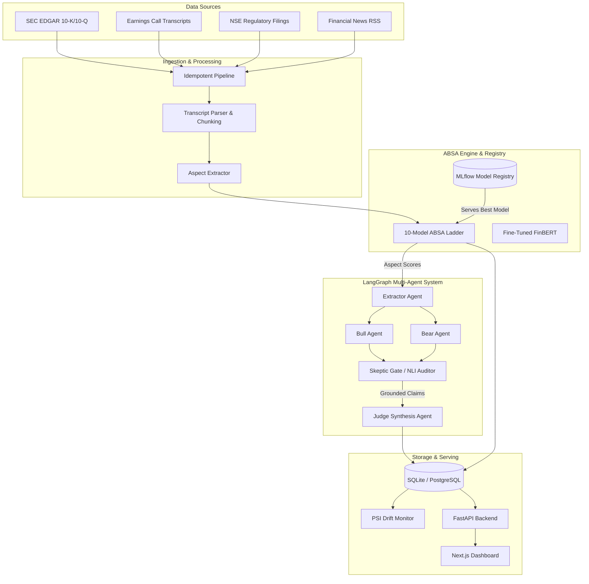
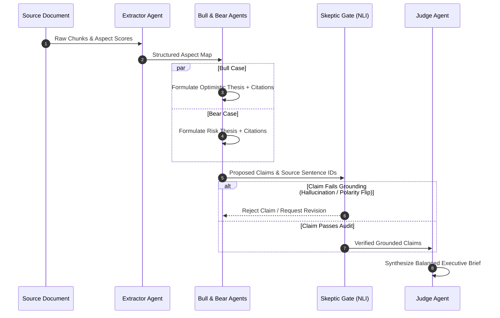

<div align="center">

# 📊 Sentari

### Financial Aspect-Based Sentiment & Multi-Agent Intelligence Engine

*Track quarter-over-quarter guidance, margin dynamics, demand trends, management tone, and litigation risks with sentence-level grounding.*

[](https://python.org)
[](https://fastapi.tiangolo.com/)
[](https://nextjs.org)
[](https://huggingface.co/ProsusAI/finbert)
[](https://mlflow.org)
[](https://docker.com)

---

</div>

> [!IMPORTANT]  
> **Research & Decision-Support Tool — Not Financial or Investment Advice.**  
> Sentari processes financial disclosures and earnings transcripts for academic research and qualitative decision support. It does not predict stock price movements or execute automated trades.

---

## 🌟 Overview

**Sentari** is an end-to-end financial intelligence framework designed to extract, score, and synthesize aspect-based sentiment across earnings call transcripts, SEC EDGAR 10-K/10-Q MD&A sections, and regulatory filings. 

Unlike traditional sentiment tools that collapse document polarity into a single scalar score, Sentari isolates **6 financial aspects** (*Guidance, Margins, Demand, Litigation, Management Tone, Liquidity*) and enforces **strict sentence-level grounding** across a multi-agent debate pipeline.

### Key Highlights

- 🎯 **Aspect-Based Extraction**: SpaCy dependency parsing combined with domain rules to extract directional financial statements.
- 🪜 **10-Model ABSA Ladder**: Benchmarked across Lexicons (VADER, SentiWordNet, Loughran-McDonald), ML (Naive Bayes, Decision Trees), Deep Learning (CNN, BiLSTM), and Fine-Tuned Transformers (**FinBERT** achieving **0.938 Macro-F1**).
- 🤖 **LangGraph Multi-Agent Debate**: Orchestrated multi-agent pipeline (`Extractor` $\rightarrow$ `Bull` $\parallel$ `Bear` $\rightarrow$ `Skeptic` $\rightarrow$ `Judge`) producing balanced, verifiable investment briefs.
- 🛡️ **Grounding Audit Gate**: Skeptic agent verifies every agent claim against verbatim source chunks, detecting numerical errors, citation mismatches, and polarity hallucinations (100% catch rate with NLI backend).
- 📈 **Quarter-over-Quarter Trajectories**: Next.js dashboard tracks aspect shifts, prepared-remarks vs. Q&A delta signals, and Population Stability Index (PSI) drift monitoring.

---

## 🏗️ System Architecture



---

## 🤖 Multi-Agent Pipeline Workflow

Sentari uses **LangGraph** to model a multi-agent debate where claims must be proven against underlying text before inclusion in executive briefs.



---

## 📊 Empirical Results & Benchmarks

Full benchmarks and evaluation reporting can be generated via [`evaluation/`](file:///C:/Users/Asus/OneDrive/Desktop/Sentari/evaluation) and [`results/REPORT.md`](file:///C:/Users/Asus/OneDrive/Desktop/Sentari/results/REPORT.md).

### 1. ABSA Model Ladder Performance
Evaluated on **94 gold-standard sentences** (6 aspects $\times$ 3 classes) and **26 financial trap sentences**:

| Model | Macro-F1 | Accuracy | Trap Sentence Acc. | Description / Features |
| :--- | :---: | :---: | :---: | :--- |
| **VADER** | `0.647` | `0.649` | `0.380` | General rule-based lexicon |
| **SentiWordNet** | `0.490` | `0.489` | `0.270` | WordNet synset scoring |
| **Loughran-McDonald (LM)** | `0.756` | `0.755` | `0.420` | Financial dictionary baseline |
| **LM + Directional Rules** | `0.892` | `0.894` | `0.850` | Financial rules + directional modifiers |
| **Naive Bayes (TF-IDF)** | `0.743` | `0.745` | `0.690` | Classical ML baseline |
| **Decision Tree (TF-IDF)** | `0.519` | `0.532` | `0.580` | Classical ML tree |
| **CNN** | `0.739` | `0.745` | `0.920` | 1D Convolutional Neural Network |
| **BiLSTM** | `0.607` | `0.638` | `0.810` | Bidirectional Recurrent Network |
| **FinBERT (Zero-Shot)** | `0.601` | `0.606` | `0.350` | Pre-trained domain transformer |
| 🏆 **FinBERT (Fine-Tuned)** | **`0.938`** | **`0.936`** | **`0.880`** | **Domain-adapted sequence classification** |

> [!NOTE]  
> **Financial Trap Analysis:** General lexicons fail on domain-inverted polarities (e.g., *"falling litigation expenses"*, *"margin compression"*). Fine-tuned FinBERT and directional rules overcome these inversions effectively.

### 2. Skeptic Adversarial Grounding Audit
Claims were artificially corrupted to test the Skeptic Gate's audit precision:

| Corruption Type | Heuristic Skeptic Catch Rate | NLI-Augmented Skeptic Catch Rate |
| :--- | :---: | :---: |
| **Number Swapped** | `100.0%` | `100.0%` |
| **Citation Removed** | `100.0%` | `100.0%` |
| **Wrong Chunk Cited** | `100.0%` | `100.0%` |
| **Fabricated Claim** | `100.0%` | `100.0%` |
| **Polarity Flipped** | `22.7%` | **`100.0%`** |

---

## 📁 Repository Structure

```
Sentari/
├── absa_service/          # Aspect extraction, model ladder, MLflow registry & FastAPI app
│   ├── models/            # Lexicon, ML, DL, and Transformer implementations
│   ├── preprocessing/     # Text normalization, negation & hedge parsing
│   ├── aspect_extraction.py
│   ├── registry.py        # Model serving registry
│   ├── scoring.py         # Sentence & document scoring engines
│   ├── api.py             # FastAPI router definitions
│   └── main.py            # FastAPI service entry point
├── agents/                # LangGraph multi-agent architecture
│   ├── extractor_agent.py # Extractor & Aspect Mapper
│   ├── bull_bear_agents.py# Bull & Bear thesis builders
│   ├── skeptic_agent.py   # Grounding & NLI Verification Gate
│   ├── judge_agent.py     # Synthesis & Final Brief Generator
│   └── graph.py           # LangGraph state workflow graph
├── ingestion/             # Data scrapers & transcript normalizer
│   ├── scrapers/          # EDGAR, NSE, News, and Sample scrapers
│   └── normalize.py       # Prepared-remarks vs Q&A section parser
├── dashboard/             # Modern Next.js 16 Web Dashboard
│   ├── app/               # Next.js App Router pages (Watchlist, Tickers, Briefs, Drift)
│   └── components/        # UI components (Trajectory charts, Source drawers)
├── storage/               # SQLAlchemy models & database migrations
├── monitoring/            # Population Stability Index (PSI) drift monitoring
├── delivery/              # Email & Slack notification digest engines
├── evaluation/            # Grounding audit, lexicon failure & model comparison tools
├── deploy/                # Cloud Run deployment manifests
├── docker-compose.yml     # Multi-container service specification
└── Dockerfile             # Core API container build file
```

---

## ⚡ Quick Start

### Prerequisites
- Python `3.10+`
- Node.js `18+` & `npm`
- SpaCy language model `en_core_web_sm`

### 1. Installation & Environment Setup

```bash
# Clone the repository
git clone https://github.com/nishnarudkar/Sentari.git
cd Sentari

# Create virtual environment & install dependencies
python -m venv .venv
source .venv/bin/activate  # Windows: .venv\Scripts\activate
pip install -r requirements.txt

# Download spaCy model
python -m spacy download en_core_web_sm

# Configure environment
cp .env.example .env
```

### 2. Run Pipeline & CLI Commands

```bash
# Run full offline test suite (49 tests)
pytest -q

# Run end-to-end daily pipeline (Ingestion -> ABSA -> Agents -> Drift -> Digest)
python -m absa_service.cli daily

# Single sentence ABSA analysis
python -m absa_service.cli analyze "Gross margin expanded 180 basis points, but we are lowering our guidance."
```

### 3. Launch Backend API & Dashboard

```bash
# Start FastAPI backend (http://localhost:8000)
uvicorn absa_service.main:app --port 8000 --reload

# In a new terminal, launch Next.js dashboard (http://localhost:3000)
cd dashboard
npm install
npm run dev
```

---

## ⚙️ Environment Configuration

Refer to [`SETUP.md`](file:///C:/Users/Asus/OneDrive/Desktop/Sentari/SETUP.md) for full configuration guidelines.

| Variable | Description | Default |
| :--- | :--- | :--- |
| `DATABASE_URL` | Relational database connection string | `sqlite:///sentari.db` |
| `SENTARI_LLM` | Agent execution backend (`heuristic` or `anthropic`) | `heuristic` |
| `ANTHROPIC_API_KEY` | Anthropic Claude API key for LLM agents | *Optional* |
| `SENTARI_NLI` | Skeptic agent verification backend (`heuristic` or `hf`) | `heuristic` |
| `SENTARI_MODEL` | Override active model serving selection | `finbert_finetuned` |
| `MLFLOW_TRACKING_URI` | MLflow experiment tracking URI | `./mlruns` |
| `SENTARI_USER_AGENT` | SEC EDGAR API compliance header | `SentariResearch contact@sentari.ai` |

---

## 🎓 Academic Credit & License

- **Author**: Nishant Vikas Narudkar
- **Institution**: RAIT (D Y Patil University)
- **Course**: Final-Year Project, Sentiment Analysis (`231CAUEC51`)
- **Full Specification**: [`project.md`](file:///C:/Users/Asus/OneDrive/Desktop/Sentari/project.md)

---

<div align="center">
  <sub>Built for transparent financial disclosure analysis. Sentari &copy; 2026.</sub>
</div>
